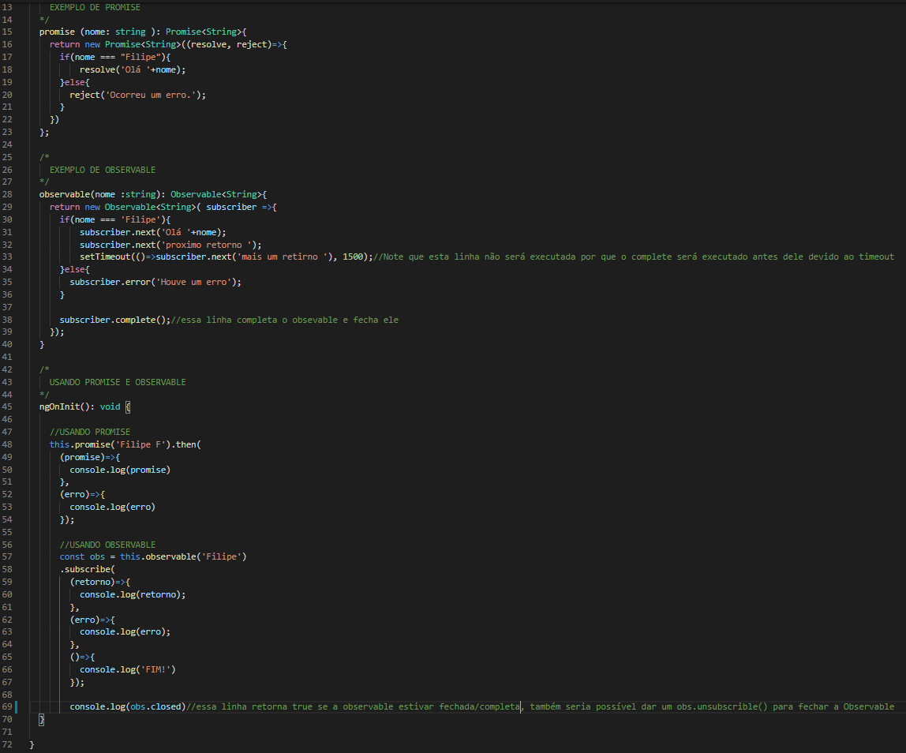

# PromisesEObservables

Note que a Observable oferece mais recursos que uma promise, porém quando implementada deve-se prestar atenção em fecha-la quando a mesma não for mais necesária para evitar uso excessivo de recursos.

