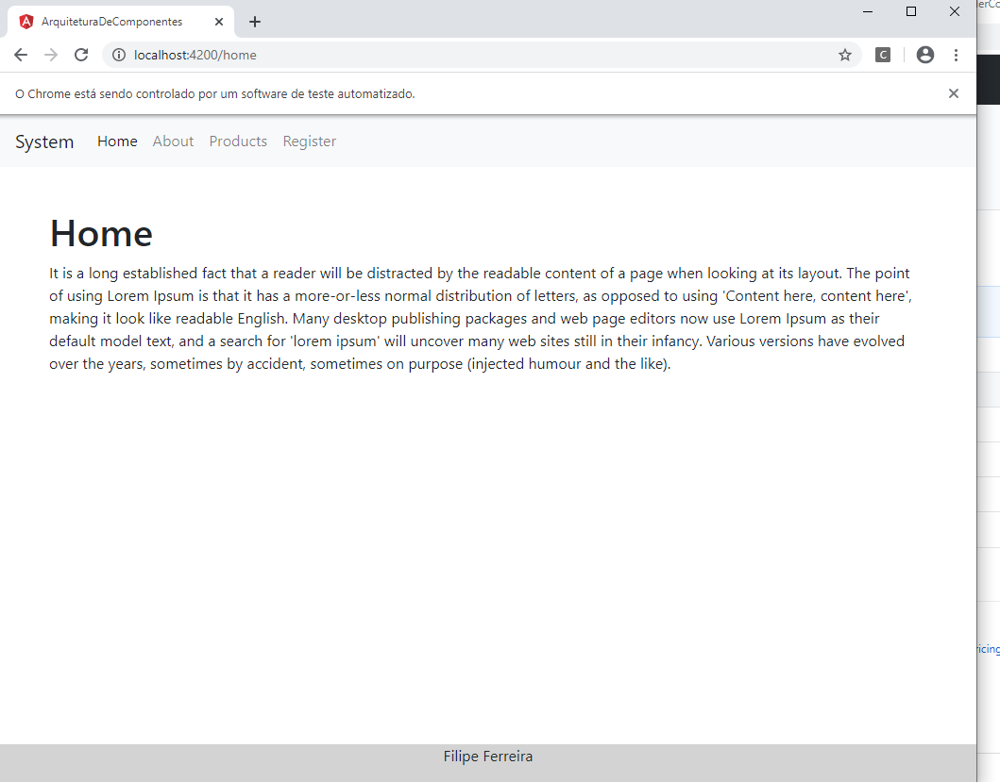
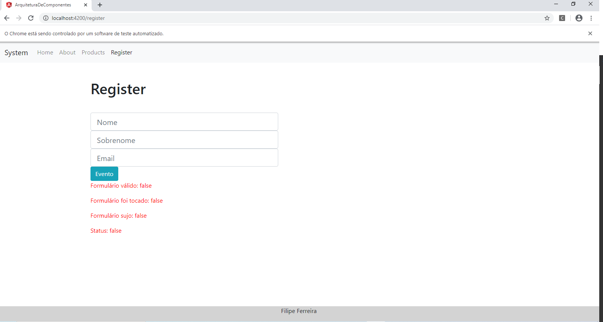
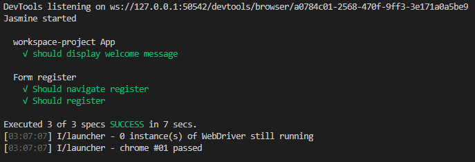

# Teste de integração no Angular e2e

Neste repositório realizei uma experiência no angular com testes e2e, usando protractor... O teste se asemelha a um robô que entra no site e vai na página de registro, faz um cadastro e confere o resultado.

- local e2e/src/

- comando 'ng e2e' na raiz do projeto

