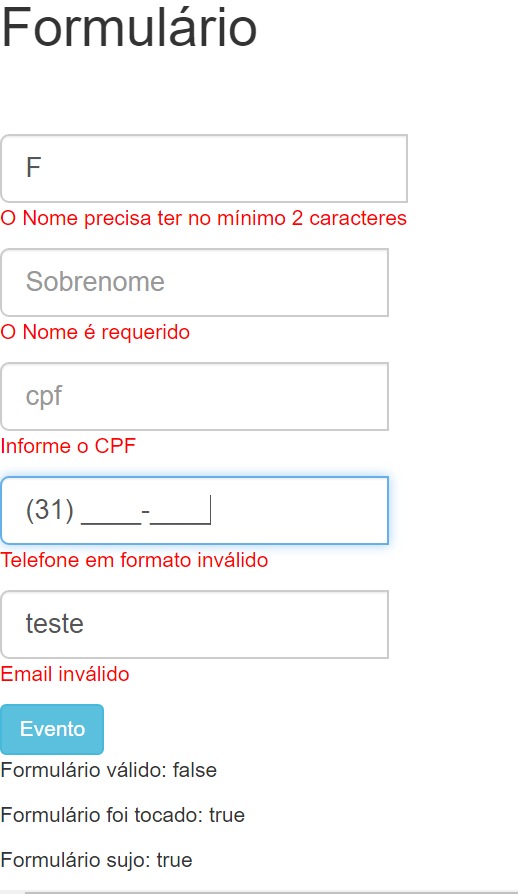

# Formulários

Para diminuir a verbosidade e garantir que a validação só apareça no evento de 'blur', foi criada uma classe especializada em verificar as válidações e com auxílio de uma observable o erro aparece na tela somente após o usuário sair do input.

Também usei Validators de outros pacotes: https://www.npmjs.com/package/ng-brazil/v/2.0.9

